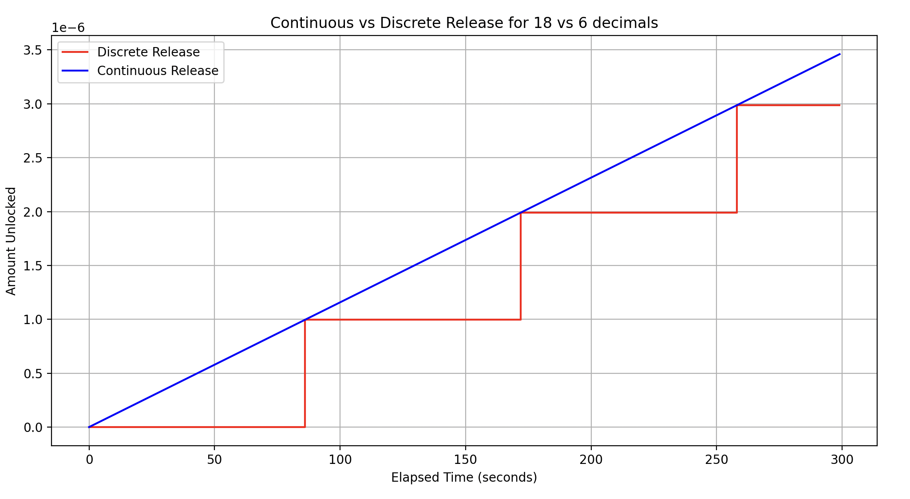
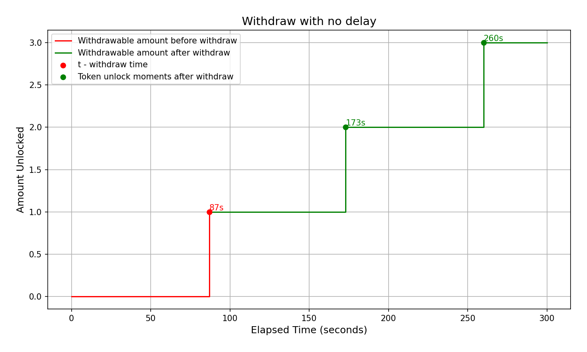
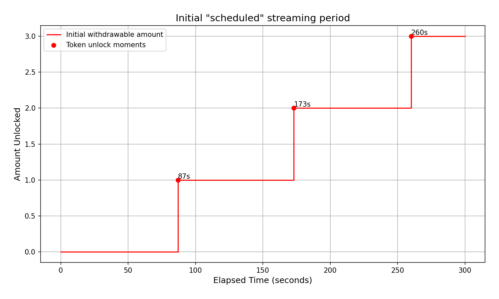
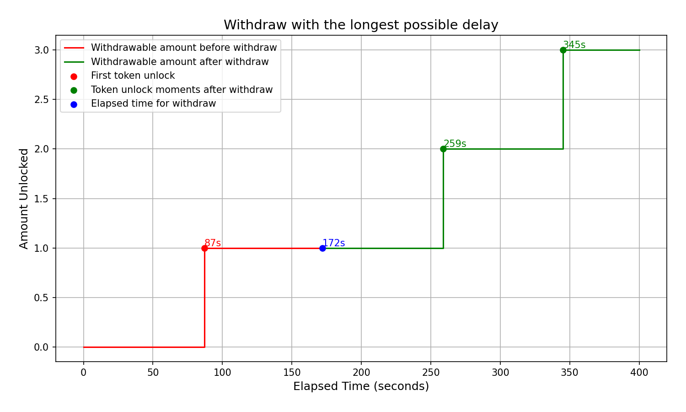

# Precision issue

Please review the [corresponding section](https://github.com/sablier-labs/flow/?tab=readme-ov-file#precision-issues) in
the README first, as here, we will build on top of that information.

**Note:** The issues described below would not lead to loss of funds, but can affect the streaming experience for users.

## Defining rps as 18 decimal number

### Problem 1: Relative delay

From the aforementioned `README` section, we define the **Relative Delay** as the minimum period (in seconds) that a
N-decimal rps system would require to stream the same amount of tokens that the 18-decimal rps system would.

```math
\text{relative\_delay}_N = \frac{ (rps_{18} - rps_N) }{rps_N} \cdot T_{\text{interval}}
```

For example, in a 6-decimal rps system, to stream 10e6 tokens, the correspondong $rps_{18}$ and $rps_6$ would be
$0.000115740740740740$ and $0.000115$, respectively. And therefore, we can calculate the relative delay for a one day
period as follows:

```math
\text{relative\_delay}_6 = \frac{ (0.000115740740740740 - 0.000115)}{0.000115} \cdot 86400 \approx 556 \, \text{seconds}
```

Similarly, relative delays for other time intervals can be calculated:

- 7 days: ~1 hour, 5 minutes
- 30 days: ~4 hours, 38 minutes
- 1 year: ~2 days, 8 hours

Using an 18-decimal rps system would not cause relative delay to the streamed amount.

### Problem 2: Minimum Transferable Value

**Minimum Transferable Value (mvt)** is defined as the smallest amount of tokens that can be streamed in one second. In
an N-decimal rps system, the mvt cannot be less than 1 token. For example, in USDC, the mvt is `0.000001e6` USDC, which
is equivalent to streaming `0.0864e6` USDC per day. If we were to stream a high priced token, such as a wrapped Bitcoin
with 6 decimals, then such system could not allow users to stream less than `0.0864e6 WBTC = $5184` per day (price taken
at $60,000 per BTC).

By using an 18-decimal rps system, we can allow streaming of amount less than minimum Transferable Value.

The above issues are inherent to **all** decimal systems, and get worse as the number of decimals used to represent rps
decreases. Therefore, we took the decision to define `rps` as an 18-decimal number so that it can minimize, if not
rectify, the above two problems.

## Delay due to Descaling

Even though `rps` is defined as an 18-decimal number, transfer functions require descaling of the debt amount back to
the token decimals. The descaling involves dividing the streamed amount calculated using 18-decimal rps by
$10^{18 - N}$. This expression is called as $\text{ongoing debt}$.

```math
\text{ongoing debt} = \frac{rps_{18} \cdot \text{elapsed time}}{10^{18-N}}
```

Descaling, thereforem can re-introduces a delay as described in the previous section. However, note that this problem
can only be seen when the following conditions are met:

1. Streamed token has less than 18 decimals; and
2. `rps` has more significant digits than `mvt` [^1]

> [!IMPORTANT] $2^{nd}$ condition is crucial in this problem.

A simple example to demonstrate the problem can be found by choosing an `rps` such that it is less than the `mvt`, such
as rps = 0.000000_011574e18 (i.e. ~ `0.000010e6` tokens / day).

### Unlock and Constant Interval

Ongoing debt is defined as the product of rps and the elapsed time, divided by the scaling factor (i.e. $10^{18-N}$). It
is the amount of

In case of above example, because of the delay caused by descaling and the mvt, there exists a time range, $[t_0,t_1]$,
during which the ongoing debt remains _constant_.

So, we define the **unlock interval** as the time period (in seconds) it would take for ongoing debt to incerement by
`mvt` i.e. the number of seconds at which it "unlocks" one unit of token.

Using the same example, we can calculate `unlock_interval` as follows:

```math
\left.
\begin{aligned}

\text{rps} &= 1.11574 \cdot 10^{-8} \cdot 10^{18} = 1.11574 \cdot 10^{10} \\
\text{factor} &= 10^{18 - \text{decimals}} = 10^{12} \\
\text{unlock\_interval} &= \frac{\text{factor}}{\text{rps}} \\

\end{aligned}
\right\}
\Rightarrow
```

```math
\text{unlock\_interval} = \frac{10^{12}}{1.11574 \cdot 10^{10}} \approx 86.4 \, \text{seconds}
```

**Note:** Because the smallest unit of time in Solidity is seconds and it has no concept of _rational numbers_, there
exist two possible solutions for values of unlock interval:

```math
\text{unlock\_interval}_\text{solidity} \in \left\{ \left\lfloor \text{unlock\_interval} \right\rfloor, \left\lceil \text{unlock\_interval} \right\rceil \right\} = \{86, 87\}
```

Therefore, constant interval, defined as the maximum number of seconds that the ongoing debt remains constant after
newly unlocked tokens, can be calculated as:

```math
\Rightarrow \text{constant\_interval}_\text{solidity} = \text{unlock\_interval}_\text{solidity} - 1 = \{85, 86\}
```

The following Python code can be used to calculate the above mentioned `unlock_interval` as a value not than 86 seconds
and no more than 87 seconds.

<details><summary> Click to expand Python code</summary>
<p>

```python
# 0.001e6 tokens per day
rps = 0.000000011574e18
sf = 1e12

# the ongoing debt will be unlocking 1 token per [unlock_interval, unlock_interval + 1] seconds
# i.e. floor(sf / rps) && ceil(sf / rps)
unlock_interval = sf // rps


def ongoing_debt(elt):
    return elt * rps // sf


# track the seconds when ongoing debt increases and the intervals between those seconds
seconds_with_od_increase = []
time_between_increases = []

# test run for 30 days, which should be suffice
for i in range(1, 86400 * 30):
    curr_od = ongoing_debt(i)
    prev_od = ongoing_debt(i - 1)

    diff = curr_od - prev_od
    assert diff in [0, 1]

    # if the diff is 1, it means the ongoing debt has increased with one token
    if diff > 0:
        seconds_with_od_increase.append(i)
        if len(seconds_with_od_increase) > 1:
            time_between_increases.append(
                seconds_with_od_increase[-1] - seconds_with_od_increase[-2]
            )

            assert time_between_increases[-1] in [
                unlock_interval,
                unlock_interval + 1,
            ]


print(
    "time_between_increases 86 seconds",
    time_between_increases.count(unlock_interval),
)
print(
    "time_between_increases 87 seconds",
    time_between_increases.count(unlock_interval + 1),
)

```

</p>
</details>

$~$

> [!NOTE] From now on, "unlock interval" and "constant interval" will be used in context of solidity. The abbreviation
> "$\text{uis}$" will be used to represent unlock interval.

### Ongoing debt as a discrete function of time

By now, it is clear that the ongoing debt is no longer a _continuous_ function with respect to time. Rather, it displays
a discrete behaviour that changes its value after every $\text{unlock intervals}$ or "$uis$".

As can be seen in the graph below, the red line represents the ongoing debt for a token with 6 decimals, whereas the
blue line represents the same for a token with 18 decimals.

|  |
| :-----------------------------------------------------------: |
|                         **Figure 1**                          |

The following Python function takes rps and elapsed time as inputs and returns all the unlock intervals for that elapsed
period:

```python
def find_unlock_intervals(rps, elt):
    unlock_intervals = []
    for i in range(1, elt):
        curr_od = od(rps, i)
        prev_od = od(rps, i-1)
        if curr_od > prev_od:
            intervals.append(i)
    return intervals
```

<a name="unlock-time-results"></a> For rps = 0.000000011574e18 and elt = 300, it returns uis_3 = {87, 173, 260}, which
are the exact number of seconds at which new tokens would be unlocked.

### Understanding delay with a concrete example

The following functions cause delay in the calculation of streamed amount. This is due to the fact that they calculate
ongoing debt (which introduces delay due to descaling) and update them to snapshot debt along with snapshot time.

1. `adjustRatePerSecond`
2. `pause`
3. `withdraw`

For this section, we will only focus on `withdraw` function.

Using the same notation for time range during which ongoing debt remains constant, $[t_0,t_1]$, we will have three cases
for updating snapshot debt:

3. $t = t_1$

#### Case 1: $t = t_0$

In this case, the snapshot time is updated to $t_0 = 87$, which is a no-delay scenario, because a token is unlocked at
$t_0$. Therefore, the point on the streamed curve is synchronized with the continuous streaming period (Figure 3).

|  |
| :---------------------------------------------: |
|                  **Figure 2**                   |

An example test contract,`test_Withdraw_NoDelay`, can be found
[here](./tests/integration/concrete/withdraw-delay/withdrawDelay.t.sol) that represents the above graph.

#### Case 2: $t_0 < t < t_1$

In case 2, the snapshot time is updated to $t_1 - 1$, which is a maximum-delay scenario. According to the calculations
from [here](#t-calculations) and [here](#unlock-time-results), we would have a delay of
$uis_2 - uis_1 - 1 = 85 \, \text{seconds}$, which is highlighted at two points in the graphs below, marking the moment
when the third token is unlocked.

The figure below illustrates the initial scheduled streaming period:

|  |
| :-----------------------------------------------------: |
|                      **Figure 3**                       |

In the following graph, we represent the right shift of the ongoing debt after the `withdraw` function is called:

|  |
| :--------------------------------------------------: |
|                     **Figure 4**                     |

To check, the contract works as expected, we have the `test_Withdraw_LongestDelay` Solidity test for the above graph
[here](./tests/integration/concrete/withdraw-delay/withdrawDelay.t.sol).

#### Case 3: $t = t_1$

In case 3, the result is similar to case 2, but with a shorter delay.

We can derive the formula as follow:

```math
\text{delay} = t - st - uis_i
```

The $\text{unlock\,time}_\text{i}$ is the time prior to `t`, when the ongoing debt has unlocked a token.

### Reverse engineering the delay from the rescaled ongoing debt

We can also reverse engineer the delay from the _rescaled_ ongoing debt:

```math

\begin{aligned}
\text{ongoing\_debt} &= \frac{rps \cdot (t - \text{snapshot\_time})}{\text{scaling\_factor}} \\
\text{rescaled\_ongoing\_debt} &= \text{ongoing\_debt} \cdot \text{scaling\_factor} \\
delay &= t - \text{snapshot\_time} - \frac{\text{rescaled\_ongoing\_debt}}{rps} - 1 \\

\end{aligned}

```

[^1]:
    For example, in case of USDC, relative delay exists when $rps_{18} = \text{0.000000\_123123e18}$. Since
    $mvt = 0.000001e6$, $rps_{18}$ has more significant digits than $mvt$.
