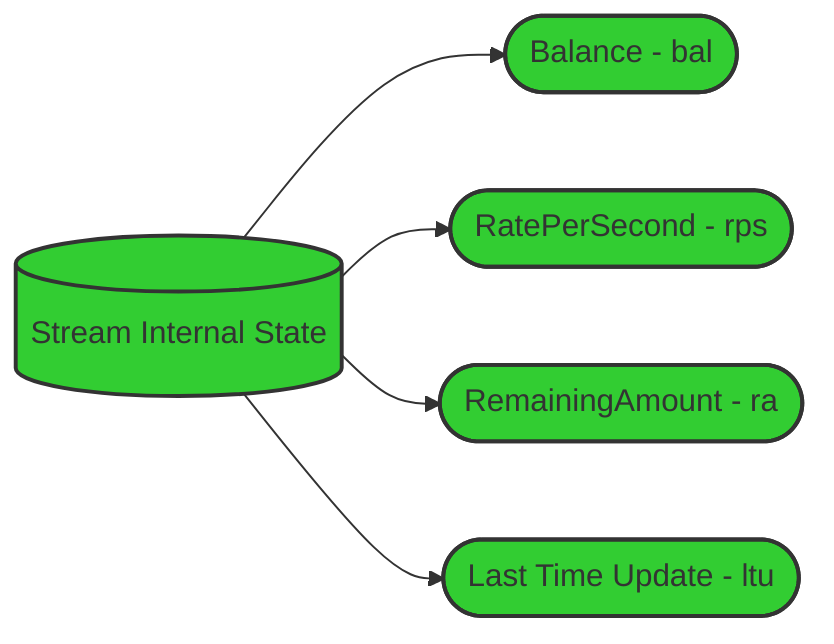
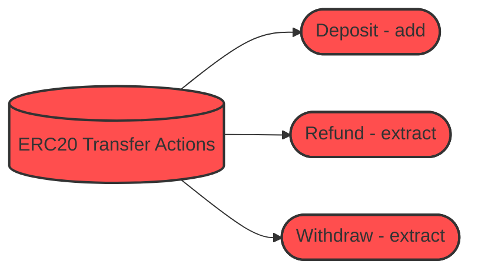
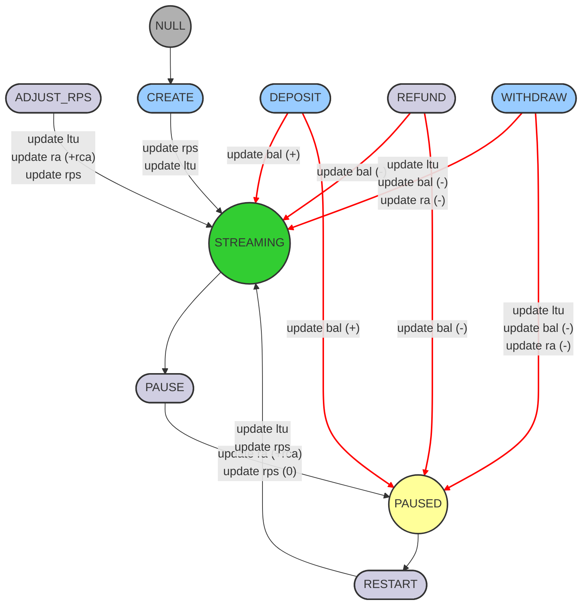
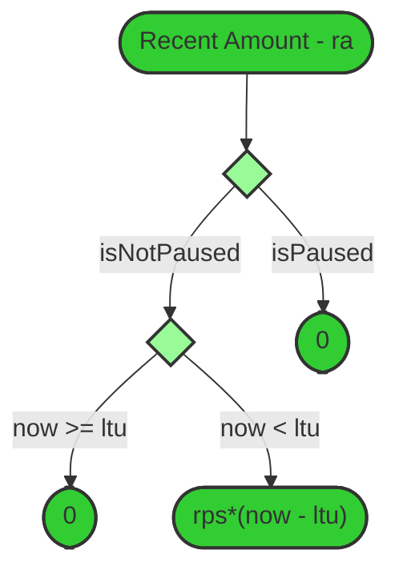
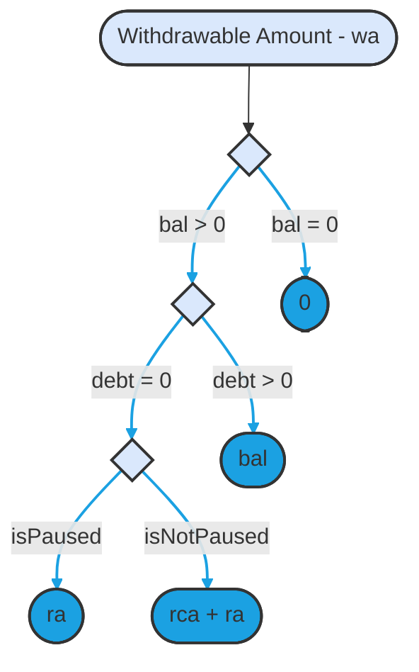
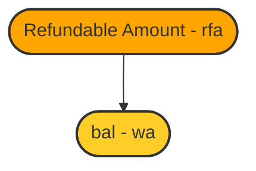
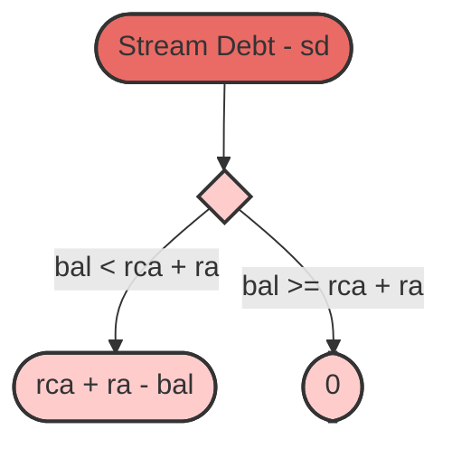

---

### State diagram

**Notes:**

1. The "update" comments refer only to the internal state
2. `ltu` is always updated to `block.timestamp`
3. Blue functions can be called by anyone
4. Purple functions can be called only by the sender

---

### Recent Amount

**Notes:** `now` refers to `block.timestamp`.

### Withdrawable Amount

**Notes:** Debt greater than zero means:

1. `ra > bal`
2. `ra + rca > bal`

### Refundable Amount

### Stream Debt

