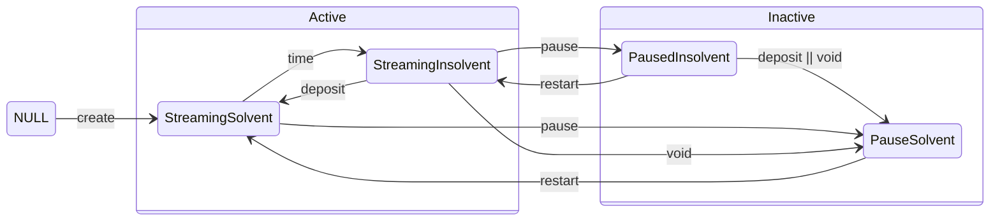
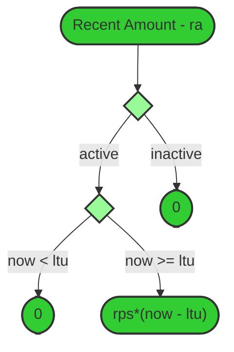

## Statuses

### Types

| Type   | Statuses                              | Description                                                   |
| :----- | :------------------------------------ | :------------------------------------------------------------ |
| Active | Streaming Insolvent, StreamingSolvent | The amount owed to the recipient is increasing over time.     |
| Paused | PauseSolvent, PausedInsolvent         | The amount owed to the recipient is not increasing over time. |

| Status              | Description                          |
| ------------------- | ------------------------------------ |
| Streaming Solvent   | Active stream when there is no debt. |
| Streaming Insolvent | Active stream when there is debt.    |
| Paused Solvent      | Paused stream when there is debt.    |
| Paused Insolvent    | Paused stream when there is no debt. |

### Statuses diagram

The transition between statuses is done by specific functions, which can be seen in the text on the edges or by the
time.

### Function calls

**Notes:**

1. The "update" comments refer only to the internal state
2. `ltu` is always updated to `block.timestamp`
3. Red lines refers to the function that are doing an ERC20 transfer

```mermaid
flowchart LR
    subgraph Statuses
        NULL((NULL)):::grey
        ACV((ACTIVE)):::green
        INACV((INACTIVE)):::yellow
    end


    subgraph Functions
        CR([CREATE])
        ADJRPS([ADJUST_RPS])
        DP([DEPOSIT])
        WTD([WITHDRAW])
        RFD([REFUND])
        RST([RESTART])
        PS([PAUSE])
        VD([VOID])
    end

    BOTH((  )):::black

    classDef grey fill:#b0b0b0,stroke:#333,stroke-width:2px;
    classDef green fill:#32cd32,stroke:#333,stroke-width:2px;
    classDef yellow fill:#ffff99,stroke:#333,stroke-width:2px;
    classDef black fill:#000000,stroke:#333,stroke-width:2px;

    CR -- "update rps\nupdate ltu" --> NULL
    ADJRPS -- "update ra (+rca)\nupdate rps\nupdate ltu" -->  ACV

    DP -- "update bal (+)" --> BOTH

    RFD -- "update bal (-)" --> BOTH

    VD -- "update ra (bal)\nupdate rps (0)" --> BOTH

    WTD -- "update ra (-) \nupdate ltu\nupdate bal (-)" --> BOTH

    PS -- "update ra (+rca)\nupdate rps (0)" --> ACV

    BOTH --> ACV & INACV

    RST -- "update rps \nupdate ltu" --> INACV

    linkStyle 2,3,5 stroke:#ff0000,stroke-width:2px
```

## Access Control

| Action              |         Sender         | Recipient | Operator(s) |      Unknown User      |
| ------------------- | :--------------------: | :-------: | :---------: | :--------------------: |
| AdjustRatePerSecond |           ✅           |    ❌     |     ❌      |           ❌           |
| Deposit             |           ✅           |    ✅     |     ✅      |           ✅           |
| Refund              |           ✅           |    ❌     |     ❌      |           ❌           |
| Restart             |           ✅           |    ❌     |     ❌      |           ❌           |
| Pause               |           ✅           |    ❌     |     ❌      |           ❌           |
| Transfer NFT        |           ❌           |    ✅     |     ✅      |           ❌           |
| Void                |           ❌           |    ✅     |     ✅      |           ❌           |
| Withdraw            | ✅ (only to Recipient) |    ✅     |     ✅      | ✅ (only to Recipient) |

### Internal State

## Amount Calculations

### Recent Amount

**Notes:** `now` refers to `block.timestamp`.

### Withdrawable Amount

**Notes:** Debt greater than zero means:

1. `ra > bal`
2. `ra + rca > bal`

### Refundable Amount

### Stream Debt

